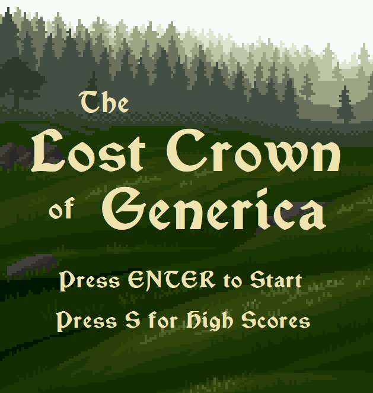
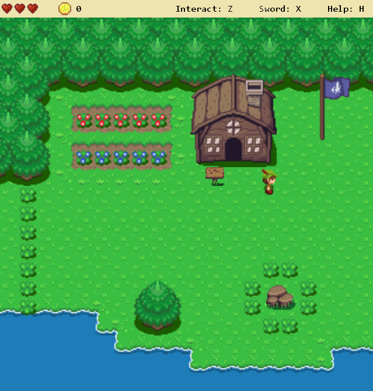

# Lost Crown of Generica
A small 2D action-adventure game in the style of an early Legend Of Zelda, made with Monogame.

Also included is a level editor I developed to visually define game screens, and a report outlining the basic game architecture and resource attribution. 

# Instructions

To run the game as an executable: Lost Crown of Generica --> LostCrownOfGenerica.exe
To run the game through Visual Studio (will require installation of Monogame libraries): Game --> HeroWalk.sln

# Screenshots

Title screen:

Gameplay:

